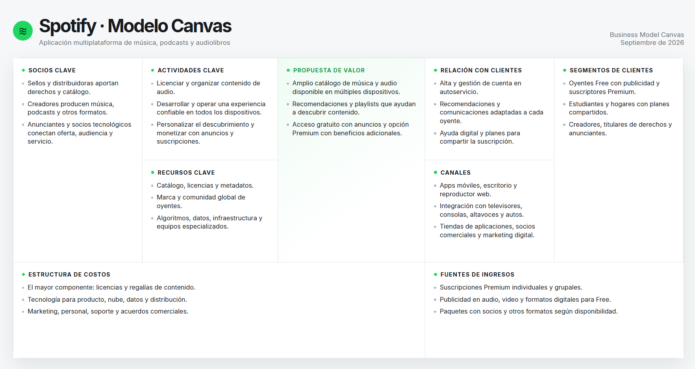

# Spotify | Modelo Canvas

Este proyecto presenta una síntesis visual del modelo de negocio de Spotify con el marco Business Model Canvas. La cuadrícula reúne sus nueve componentes: socios, actividades y recursos clave; propuesta de valor; relaciones y canales; segmentos de clientes; estructura de costos y fuentes de ingresos.

Cada tarjeta muestra los puntos principales para facilitar una lectura rápida. Al pasar el cursor o enfocar una tarjeta con el teclado, aparece una capa con información ampliada que se superpone al tablero sin mover las demás secciones. En pantallas táctiles y al imprimir, el detalle se muestra directamente.

## Uso

Abre `index.html` en un navegador. El diseño se adapta a pantallas de escritorio, tabletas y móviles; no requiere dependencias ni instalación.