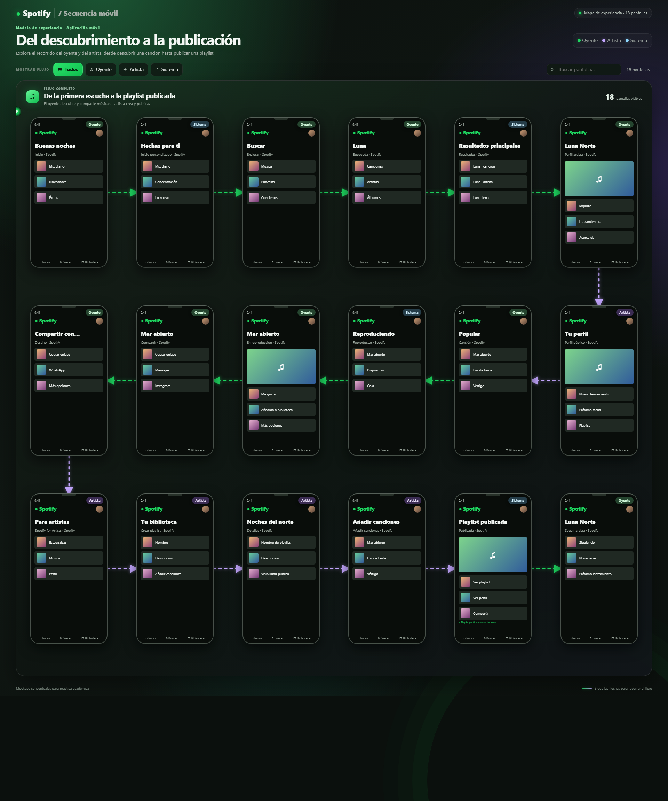

# Secuencia de pantallas: Spotify móvil

Entrega de la práctica de modelado de experiencia móvil en forma de diagrama de secuencia interactivo. El flujo muestra cómo se relacionan las pantallas de Spotify con dos roles de la plataforma: **oyente** (rol compartido) y **artista** (rol creador), además de respuestas representativas del sistema.

## Diagrama

[Ver Diagrama de secuencia](https://diegomiguel04.github.io/Practicas-INTEGRADORA/Practica06/index.html)

## Recorrido

El oyente abre Inicio, explora recomendaciones, busca una canción, visita el perfil del artista, reproduce y guarda una pista, y comparte su enlace. En paralelo, el artista actualiza su perfil, accede a herramientas de artista, crea una playlist, añade canciones y la publica. Al final, el oyente sigue al artista y recibe sus novedades.

Las 18 pantallas están organizadas así:

1. Inicio
2. Inicio personalizado
3. Explorar
4. Búsqueda
5. Resultados
6. Perfil del artista
7. Perfil público del artista
8. Canción
9. Reproductor
10. En reproducción y biblioteca
11. Compartir
12. Destino para compartir
13. Spotify for Artists
14. Crear playlist
15. Detalles de playlist
16. Añadir canciones
17. Confirmación de publicación
18. Seguir artista

## Uso

Abre `spotify-mockups.html` en un navegador. Usa los botones para filtrar Oyente, Artista o Sistema, el campo de búsqueda para encontrar una pantalla y selecciona una tarjeta para ampliar su mockup. En la vista ampliada, Escape o el botón × la cierra.

## Validación

La especificación `spotify-sequence.json` se validó y entregó con Archify como tipo `sequence`, perfil `showcase`: **9/9 comprobaciones**, composición aprobada, 0 errores y 0 advertencias. El HTML principal de mockups se elaboró como artefacto complementario centrado en pantallas móviles.

## Alcance visual

Los mockups son sketches de interfaz creados para explicar el flujo académico. Representan patrones y contenido ficticio; no son capturas oficiales ni describen todas las funciones o pantallas actuales de Spotify.

## Versión horizontal

También se incluye [`spotify-mockups-horizontal.html`](spotify-mockups-horizontal.html), una alternativa apaisada de seis columnas por tres filas serpenteantes. Cada pantalla ocupa el primer plano con proporción de captura móvil; la etiqueta del rol aparece en una esquina y el nombre y la descripción se revelan debajo al pasar el cursor. Al seleccionar una pantalla se abre una vista ampliada con la captura completa y, a su derecha, la acción, elementos visibles y contexto de los pasos anterior y siguiente. Líneas animadas con flechas conectan las pantallas. Los filtros reacomodan en secuencia continua las pantallas visibles. El tablero puede recorrerse verticalmente para ver las capturas completas y lateralmente en ventanas estrechas. La versión vertical original permanece sin cambios.
